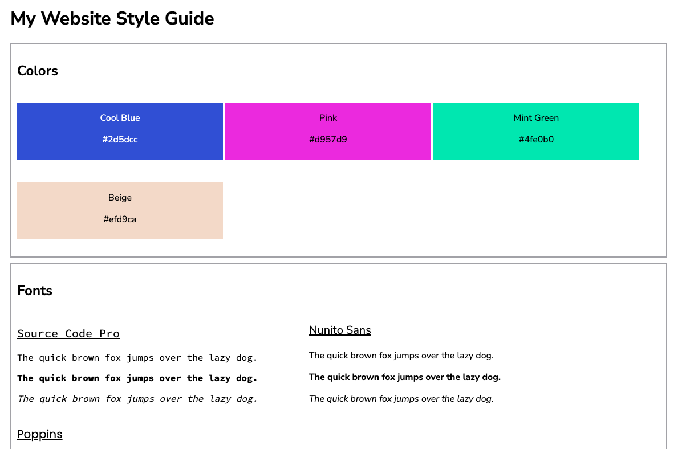
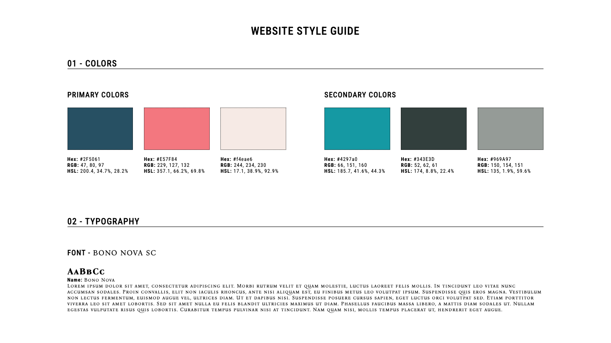

<h1>Codecademy - Web Design System Project</h1>

This project is part of the codecademy full stack course. It was to be done after completely several HTML and CSS course. no Javascript was required (Although i would like to make the page dynamic and have user inputs for colors and fonts)

Below is the outline of the project along with their example and my example below those

<em>In this project, you’ll be building your own basic design system for a website. In essence, you’ll be building a website to help you build MORE websites in the future! On your site, you’ll collect all the colors, fonts, and some of the repeating styles.</em>

<figure>
    
    <figcaption>Example of the project by Codedemy</figcaption>
</figure>

<figure>
    
    <figcaption>Example of my version of the project</figcaption>
</figure>
    